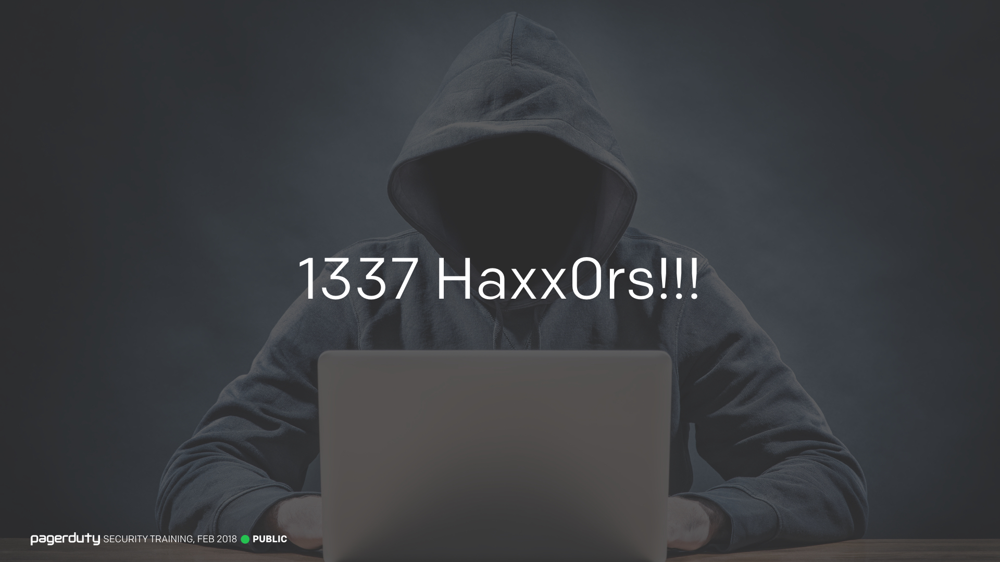
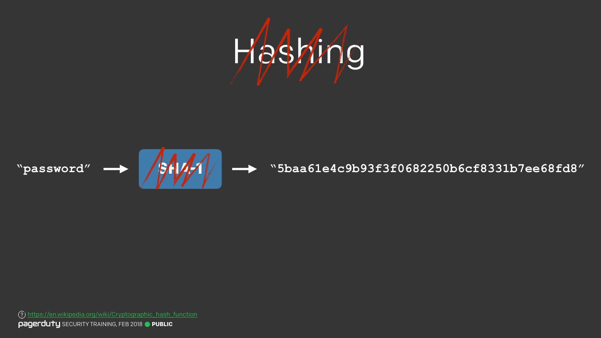
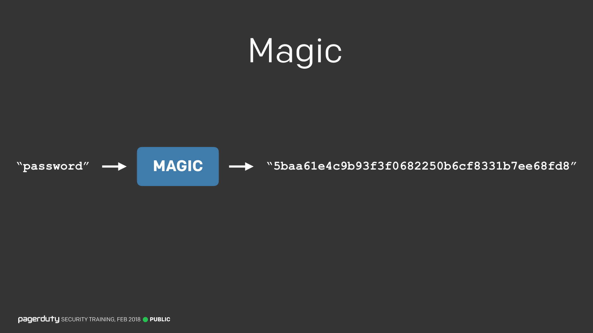
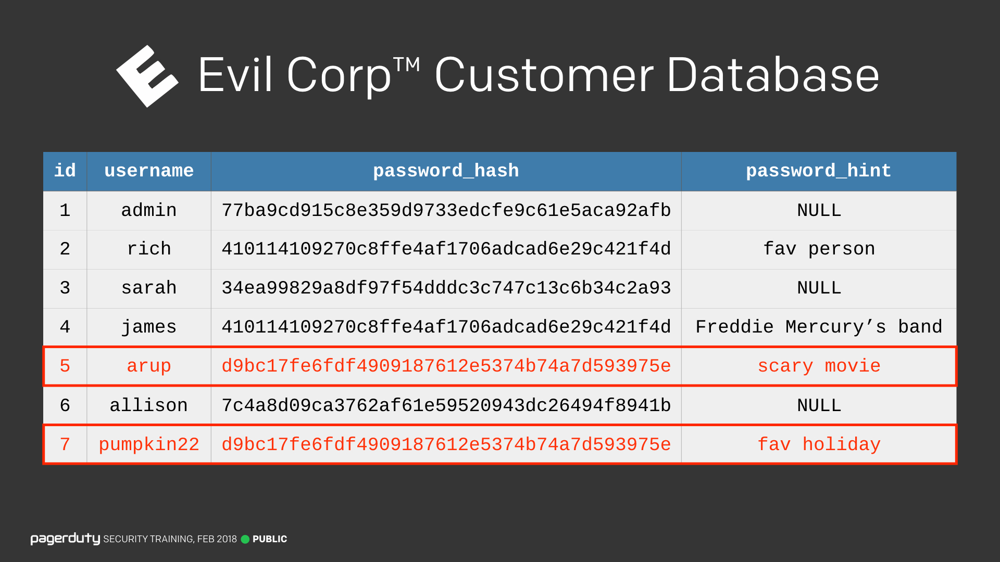
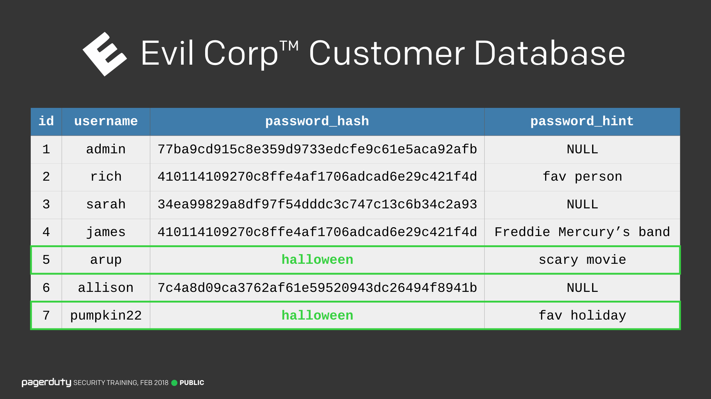
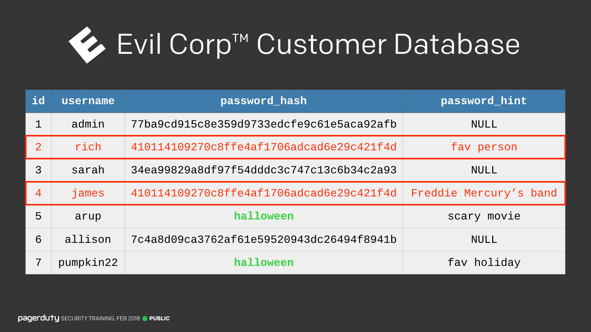
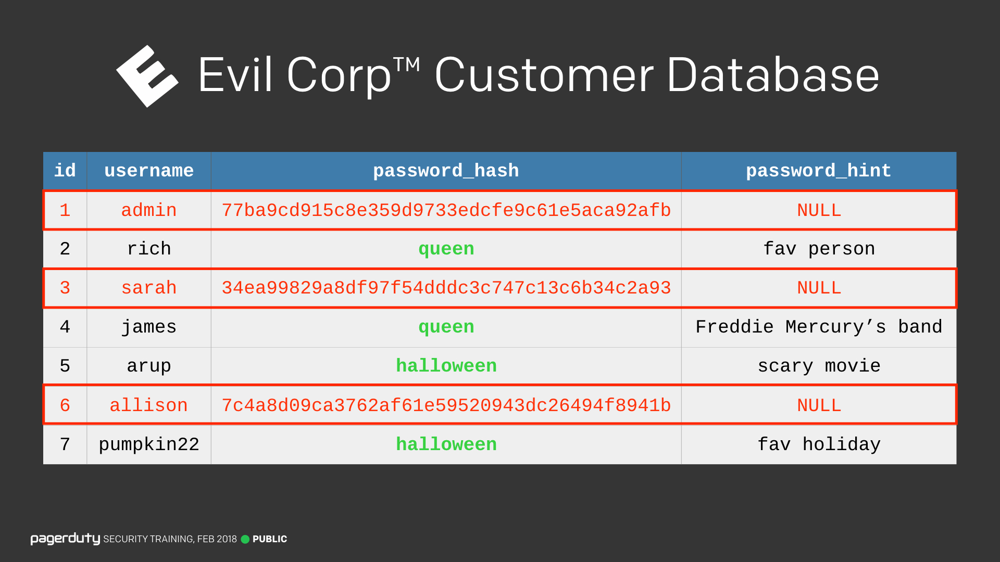
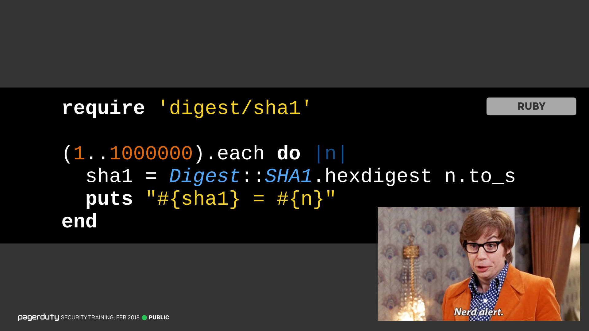
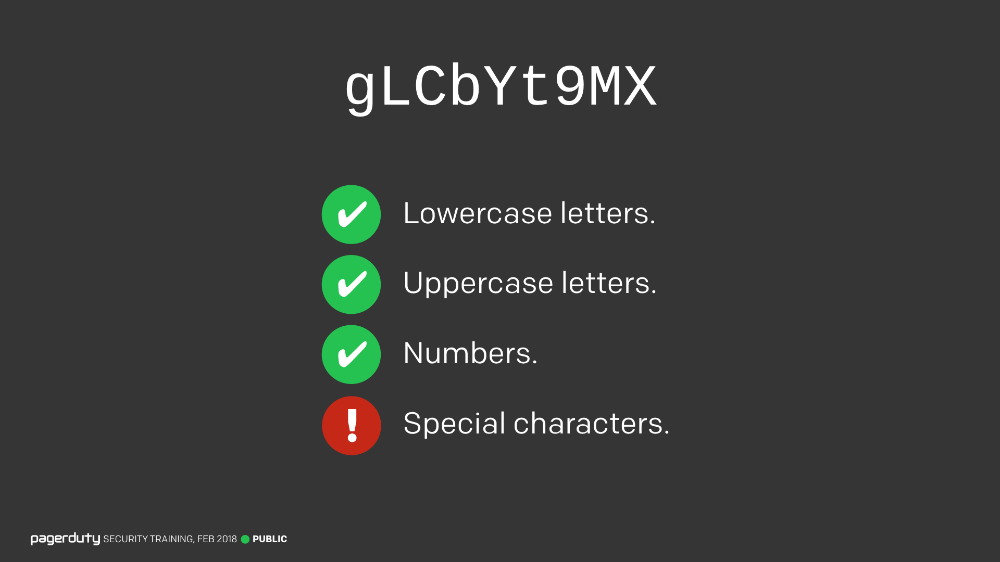
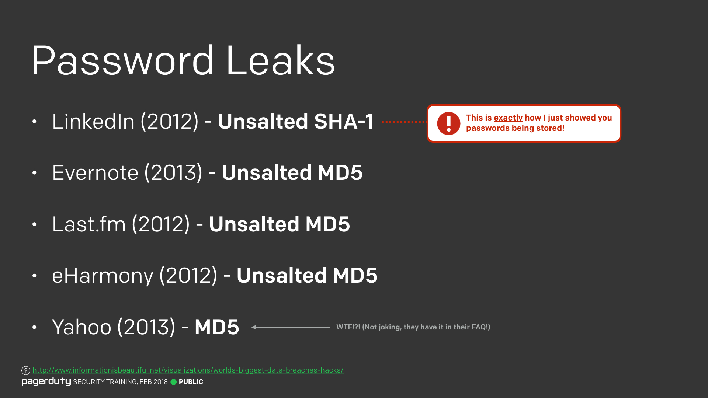

Title:
Lesson 5 | Passwords

---

Lesson Notes:
:dart: Passwords are a huge part of ensuring you protect yourself online.
:dart: Passwords are protected when stored but cracking them is easier than you’d think.

---

Lesson Content:

Hashing is the process of taking a password, doing "stuff" to it, and giving you a magic string of characters at the end. Hashing is 1) repeatable and 2) irreversible. Website store your passwords as these magic strings.

But, there are easy ways to crack magic string passwords. There are things called "Rainbow Tables", in our parlance, "Magic Lists". There are massive files that have the full collection of magic strings for all sorts of situations.

So what happens when these passwords leaks take place? Generally, once an attacker has stolen a database, they'll run it against those "Magic Lists" to produce a list of email and password combinations.

Most people reuse their email and password combinations for other things. So the attacker will start logging into all the other accounts they can, whether it's to steal information, or money. This can all be done _very_ quickly after a database is stolen. It's usually months before the breach is known, by which point it's already too late.

The point I'm trying to make is that you can't control another website's security. 
 
---

External resources:

### Passwords

_<input type="checkbox" id="047" /><label for="047"></label>_
_047. Passwords._

It's time for our next topic, everyone's favourite, Passwords.

---

### What are passwords?

<input type="checkbox" id="048" /><label for="048"></label>
_048. What are passwords?_

Hopefully you all know what a password is, but just in case you don't, here's a quick definition. Basically they're those things you have to type in all the time in order to do anything on a computer.

---

### T3h 1337 Haxx0rs!!!111one!

<input type="checkbox" id="049" /><label for="049"></label>
_049. T3h 1337 Haxx0rs!!!111one!_

Rather than just give you a list of rules for how to pick good passwords, I want to try something a bit different here. I'm going to teach you all how to be hackers, just like in the movies. I'm going to teach you how to crack passwords. Don't worry, I see some wide eyes in the audience, I'm going to keep this as untechnical as I can.

I do need to talk about one technical concept first though...

---

### Hashing

<input type="checkbox" id="050" /><label for="050"></label>
_050. Hashing. [Reference](https://en.wikipedia.org/wiki/Cryptographic_hash_function)_

...and that's something called "Hashing".

---

### \~\~Hashing\~\~

<input type="checkbox" id="051" /><label for="051"></label>
_051. \~\~Hashing\~\~. [Reference](https://en.wikipedia.org/wiki/Cryptographic_hash_function)_

Actually, you don't need to know the name.

---

### Magic

<input type="checkbox" id="052" /><label for="052"></label>
_052. Magic._

For the purpose of this discussion, it's "Magic". What this magic does is take a password, does "stuff" to it, and gives you a magic string of characters at the end.

This magic process has two important features that we care about.

---

### Repeatable

<input type="checkbox" id="053" /><label for="053"></label>
_053. Repeatable._

The first is that it's repeatable. If you give it the same password, it will always give you the same magic string. Always.

---

### Irreversible

<input type="checkbox" id="054" /><label for="054"></label>
_054. Irreversible._

The second is that it's irreversible. If you only have the magic string, there's no amount of fancy mathematics or algorithms that can get you back to the password.

The only way you know that password goes to that magic string, is if you already knew that passwords goes to that magic string.

---

### Create Account

<input type="checkbox" id="055" /><label for="055"></label>
_055. Creating an account._

So why am I telling you this? Well, it may surprise you to know that websites don't actually store your password (at least, they shouldn't). When you create an account on a website, they do this "magic" to your password, and store the result in their database instead of your password.

Why do they do this? Well, there's always at least one employee who can see the values stored in the database. If they were to store the real passwords, anyone with access to the database could have them, and not everyone is honest.

---

### Login

<input type="checkbox" id="056" /><label for="056"></label>
_056. Logging in to an account._

But if they've only stored the magic string, how do you login to websites? Well, they do the same thing again. They perform the magic on whatever you enter, and get the result.

---

### Matches?

<input type="checkbox" id="057" /><label for="057"></label>
_057. Did you enter the same thing?_

If the result matches what's in their database, then they know it's you and the login succeeds.

Websites don't really care about your password. They only care that you entered the same thing you did when you registered. So there's no need to store your actual password, they can just store a representation of it, safe in the knowledge that no one can reverse it back to a password.

Except that's what we're going to do now...

---

### Evil Corp

<input type="checkbox" id="058" /><label for="058"></label>
_058. EvilCorp customer database._

Last night I went ahead and stole a customer database. Doesn't matter where I got it from. 

This stolen database contains usernames, password hashes (that's the magic string), and a password hint. Some of you may be thinking that the password hint is cheating here. Websites don't store password hints, right? Well, some do. But you're right, most don't. So you can think of them as "Answers to Security Questions" if it makes you feel better (I'll talk more about security questions later).

We're now going to get the passwords for all of these users.

---

### pumpkin22

<input type="checkbox" id="059" /><label for="059"></label>
_059. pumpkin22._

The first thing you might notice, is that sometimes the username itself can give things away. Let's take a look at this user first. "pumpkin22", and their password hint is "fav holiday". Hrm... pumpkins, holiday. I think I have a pretty good idea of what their password is.

But remember when I told you about the two important properties of the "magic", the first was that given the same password, you always get the same magic string. So we actually have more information to help us here.

---

### arup

<input type="checkbox" id="060" /><label for="060"></label>
_060. arup._

We can see that this user "arup" has exactly the same password as "pumpkin22".

???+ comment "Presenter's Comment"
	This isn't always the case, there's something called "Hash Collision" which can occur. But I'm ignoring that here in order to keep things simple.

So now we can use "arup"'s password hint as an extra bit of information. So, "pumpkin", "holiday", "scary movie". Hopefully by now you've guessed that this password is `halloween`.

---

### halloween

<input type="checkbox" id="061" /><label for="061"></label>
_061. halloween._

So there we are, we just broke a 9 character password in less than a minute, without writing any code. Pretty cool, right?

Let's try another one.

---

### rich

<input type="checkbox" id="062" /><label for="062"></label>
_062. rich._

Let's look at the user "rich". Their password hint is "fav person". Well, that's not really much help to us. We don't know who "rich" is, and we have no idea who their favourite person is. In fact, that user probably thinks they're pretty safe, since only close friends would know the necessary information. There's no way a random attacker looking at the database could figure it out.

Unfortunately for them, another user has picked the same password.

---

### james

<input type="checkbox" id="063" /><label for="063"></label>
_063. james._

The user "james" has picked the same password, and has a much more obvious password hint. We can use this information to break the password for both users. Hopefully you can figure out that the password in this case is `queen`.

---

### queen

<input type="checkbox" id="064" /><label for="064"></label>
_064. queen._

So even though "rich" thought they were safe, because of the way this website is storing user's password information, we could use the fact someone else has the same password in order to break theirs. Remember, just because you think you haven't provided much information, someone else may have. I've seen answers to security questions that include the user's password before.

Anyway, we've now broken 4 of these 7 users' passwords in less than a few minutes, and we've still yet to write any code or look like cool hackers from the movies.

---

### No more hints.

<input type="checkbox" id="065" /><label for="065"></label>
_065. No more hints._

But now we've got a problem. There are no more password hints to help us. These users have been a bit smarter and not provided any additional information. There are no other duplicate passwords to help us, we're on our own.

So how can we break these? I said at the start that the magic was irreversible, so there's no way to get the password if you only have the magic string. I did give one caveat though. If you already know a password goes to the magic string.

I think that a lot of people use numbers in their passwords. Dates, PIN codes, etc.

---

### Hashing All The Numbers

<input type="checkbox" id="066" /><label for="066"></label>
_066. Hashing all the numbers._

So let's just run the magic on every number from 1 to 1 million. This will give us a nice directory of magic string back to password if anyone is using dates.

You might think this takes a while, and if you were doing it on pen and paper you'd be right. However, we have computers, and they're pretty fast at this kind of stuff. It took my laptop less than a second to get the first million magic strings.

---

### Nerd Alert

<input type="checkbox" id="067" /><label for="067"></label>
_067. "Nerd alert"._

You may be thinking the code is complex and you need to be a master programmer to pull off this kind of feat. Alas, it's only a few lines of code in most modern languages.

---

### 1337

<input type="checkbox" id="068" /><label for="068"></label>
_068. 1337._

So in less than a second of computational power, we've now cracked an additional two passwords. Not bad, right?

---

### sarah

<input type="checkbox" id="069" /><label for="069"></label>
_069. sarah._

But now we've got another problem. There's still one user left (there's always one!). Now, we could keep going with our numbers game, all the way up to 1 trillion or further. But let's switch gears. I want to use the same technique, but not just for numbers. A lot of people use real words as their passwords, so perhaps we can try that.

---

### Hashing All The Words

<input type="checkbox" id="070" /><label for="070"></label>
_070. Hashing all the words._

Let's run our magic on every word in the English dictionary, and do the same thing as before. Again, you may be thinking this takes a while, but again, my laptop can do it in less than a second.

And, in less than a second...

---

### No luck

<input type="checkbox" id="071" /><label for="071"></label>
_071. No luck._

...oh, we didn't find anything. That's a bummer.

Well, we can keep using this same technique at least. We could try every possible combination of numbers and uppercase/lowercase letters up to say.. 9 characters long. I wonder how many possibilities there are?

---

### Trying everything takes too long

<input type="checkbox" id="072" /><label for="072"></label>
_072. Trying everything will take too long._

It's around 13 quadrillion possible combinations. That's a lot. Far too many for my laptop to handle. In fact, it's far too many for most computers to handle in any reasonable amount of time.

Luckily for us, someone has already done the hard work.

---

### Magic Lists

<input type="checkbox" id="073" /><label for="073"></label>
_073. Magic Lists. [Reference](http://project-rainbowcrack.com/table.htm)_

There are things called "Rainbow Tables", in our parlance, "Magic Lists". There are massive files that have the full collection of magic strings for all sorts of situations. The one we're interested in is the 4th down from the top, every mixed-case alphanumeric up to 9 characters long. It's a 690GB file, which isn't too bad. We can just download that to an Amazon Web Services instance, and pay by the hour to try and crack our remaining password.

And in less than an hour...

---

### Cracked

<input type="checkbox" id="074" /><label for="074"></label>
_074. Cracked._

...we'll have broken our final password.

Pretty cool, right? Everyone feel like a movie hacker now?

Some of you may be looking at that password and getting pretty scared. I mean, it's a pretty good password to be fair.

---

### gLCbYt9MX

<input type="checkbox" id="075" /><label for="075"></label>
_075. gLCbYt9MX._

There's a mixture of cases, it's 9 characters long, there are numbers in it, it's not a real word. The only thing really missing are special characters. I would wager that a lot of you might use worse passwords than this for a lot of things, and thought your passwords were safe. How do you feel about that now?

I'm not showing you all this to scare you. Well, I guess I am a bit. But I should apologise, because I've actually let you all astray ever so slightly. The type of attack I just showed, using "Magic Lists", is not too hard to defend against.

---

### Salting

<input type="checkbox" id="076" /><label for="076"></label>
_076. Salting._

There's a technique called "salting" which can stop this type of attack from working. You don't need to know what it is, just that it works, and it's been around since at least the 1970's, probably earlier. (Another one of my favourite stock images by the way).

So great, this technique has existed forever, and stops this attack. So we're safe? No one would ever not use this "salting" stuff on their modern website.

---

### Password Leaks

<input type="checkbox" id="077" /><label for="077"></label>
_077. Password leaks. [Reference](http://www.informationisbeautiful.net/visualizations/worlds-biggest-data-breaches-hacks/)_

Unfortunately not. Lots of companies are using unsalted hashes to store their passwords. Does everyone remember the LinkedIn breach from 2012? I'm sure you all still get SPAM from it. Well, they were storing passwords _exactly_ how I just showed in the EvilCorp example. If your password was "halloween", then what you saw was exactly how they were storing it in their database.

These others here used something called "MD5", that's just the name of the "Magic" being used. MD5 is older and weaker than SHA-1, which is what I showed in my example.

Hell, even Yahoo used MD5, they had it in their FAQ for the recent breach. They didn't specify if it was salted or not, which means it probably wasn't.

If you're interested in the correct way to store passwords, come along to our [next training session for engineers](/for_engineers/) where I'll go into this in a lot more detail.

---

### What happens when passwords are leaked?

<input type="checkbox" id="078" /><label for="078"></label>
_078. What happens when passwords are leaked? [Reference](https://hotforsecurity.bitdefender.com/blog/1800-minecraft-usernames-and-passwords-leak-online-11209.html)._

So what happens when these passwords leaks take place? Generally, once an attacker has stolen a database, they'll run it against those "Magic Lists" to produce a list of email and password combinations. They might not be able to break all the passwords, but they'll get a good chunk of them.

Most people reuse their email and password combinations for other things. So the attacker will start logging into all the other accounts they can, whether it's to steal information, or money. This can all be done _very_ quickly after a database is stolen.

It's usually months before the breach is known, by which point it's already too late.

The point I'm trying to make is that you can't control another website's security. You have absolutely no control over how another website stores your password or protects their database. So you need to protect yourself instead.

---

Lesson Scenario:
What are the 2 unique traits of hashing passwords?

- <input type="checkbox"> `Repeatable`
- <input type="checkbox"> `Unrepeatable`
- <input type="checkbox"> `Irreversible`
- <input type="checkbox"> `Proprietary`
- <input type="checkbox"> `CPU intensive.`

	<button class="button">Reveal Answer</button>
	<blockquote>
Hashing is repeatable and irreversible.

</blockquote> 
