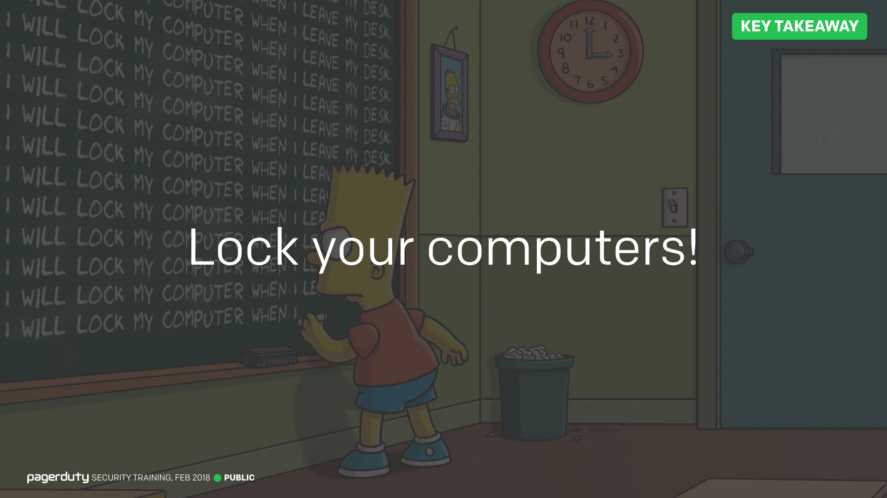
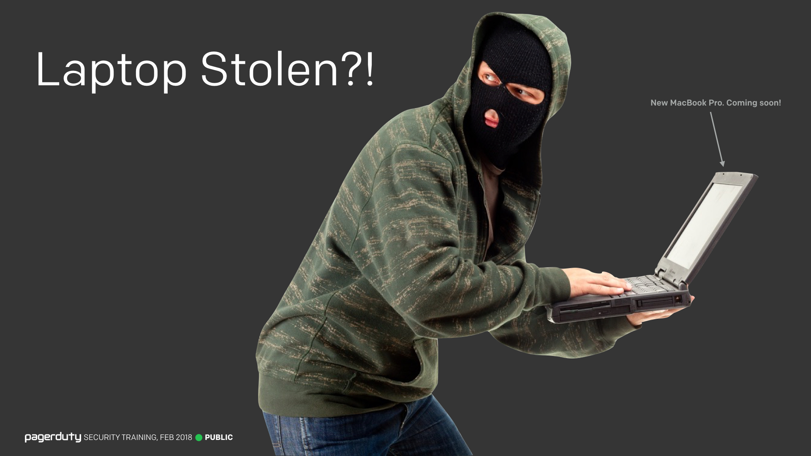

Title:
Lesson 8 | Physical Security

---

Lesson Notes:
:dart: Physical security protects our offices, devices, and people.
:dart: Notify security immediately if a device is lost or stolen.

---

Lesson Content:

Physical security is security that's designed to protect our office, personnel, and equipment.

It's important to keep our office environment secure though, we don't want random folks wandering around stealing information or equipment. If you see something suspicious, ask questions. 

Please lock your computers when you're not with them. It literally only takes a few seconds for someone to plug in a USB stick and they've now loaded malware on to your machine.

Beware of "Piggybacking", this is where someone else follows you through a secure door on your keycard swipe. 

---

External resources:

### Physical Security

_<input type="checkbox" id="107" /><label for="107"></label>_
_107. Physical Security._

These next two sections will go much quicker, I promise. We're now going to talk about physical security. I don't mean bouncers.

---

### What is physical security?

<input type="checkbox" id="108" /><label for="108"></label>
_108. What is physical security?_

I mean security that's designed to protect our office, personnel, and equipment.

---

### Basic Guidelines

<input type="checkbox" id="109" /><label for="109"></label>
_109. Basic Guidelines._

It's very easy to lose track of who works here and who doesn't at any given time. Gone are the days where we could all fit into a single meeting room.

It's important to keep our office environment secure though, we don't want random folks wandering around stealing information or equipment. If you see someone you don't recognize acting suspicious, just ask questions. Introduce yourself and make a new friend, since 99% of the time it's going to be an employee you've simply not met yet.

If their answers don't satisfy you, and you think they're sketchy, alert the security team and we'll take care of it. Don't put yourself in danger, and leave if you feel uncomfortable.

---

### Ask Questions

<input type="checkbox" id="110" /><label for="110"></label>
_110. Ask Questions._

If you see something suspicious, ask questions. But be polite, don't shove someone up against the wall shouting "Who do you work for!!?!?!", this isn't a movie. If someone is wandering around looking lost, ask them where they're heading. It's likely just a new employee.

If someone you don't recognize is sitting at your friends desk using their laptop though, that's something you probably want to let the security team know about pretty quickly. Speaking of which...

---

### Lock Your Computers!

<input type="checkbox" id="111" /><label for="111"></label>
_111. Lock Your Computers!._

Please lock your computers when you're not with them. This is even more important when working remote. It literally only takes a few seconds for someone to plug in a USB stick and they've now loaded malware on to your machine.

If you wander around the office and see someone else's computer unlocked, please lock it for them, then send them a private message on Slack letting them know it was unlocked and that you locked it. Resist the urge to troll the user by changing their background or typing as them on Slack. That's not the kind of environment we're trying to foster.

Also we used to do that, and it just makes people feel bad and doesn't give you the results you want.

---

### Piggybacking

<input type="checkbox" id="112" /><label for="112"></label>
_112. Piggybacking._

Beware of "Piggybacking", this is where someone else follows you through a secure door on your keycard swipe. A common social engineering trick is to just act like you belong and follow people through a door they've opened for you. Usually carrying something heavy with both hands to explain why they can't swipe their own keycard.

Always verify other people coming in on your keycard. If they're co-workers you recognise, then of course let them in. But if you don't recognise them, ask them to tap their own keycard too. Then introduce yourself, and make a new friend, since it's a coworker you'd not met yet.

Likewise, if you're following someone through a door and they ask you to tap your keycard, please don't give them any grief. Tap your keycard, and then introduce yourself and make a friend.

---

### Building Security

<input type="checkbox" id="114" /><label for="114"></label>
_114. Building Security._

Once you've used your keycard to unlock a door, please don't prop it open. The doors are locked for a reason, and propping them open kind of defeats that. Listen for the sound of the door closing behind you.

Make sure all your visitors sign in at the front desk, and have a name badge. Not only is this good security practice, but it's required for fire safety too, so we know how many people are in the building should we need to evacuate.

---

### Laptop Stolen?!

<input type="checkbox" id="115" /><label for="115"></label>
_115. Laptop stolen?!._

So you're at a bar after work, you look down on the floor and see that your backpack has been stolen, and your company issued laptop was in there. It was likely stolen by someone wearing a balaclava, since we know that's what all criminals wear based on my stock image searches.

What do you do?

---

### Panic?

<input type="checkbox" id="116" /><label for="116"></label>
_116. Panic?._

Your first instinct is to probably panic. That's OK, it's a natural reaction.

---

### Don't Panic

<input type="checkbox" id="117" /><label for="117"></label>
_117. Don't Panic._

But don't panic. Things get stolen, it's just the world we live in. You're not going to get fired, you're not going to get into trouble.

_(Unless you stole the laptop yourself, in which case, yeah.. you'll probably get into trouble)._

---

### Page Security

<input type="checkbox" id="118" /><label for="118"></label>
_118. Page us!._

Message security or helpdesk at any time if you have lost or had stolen, any devices that access company information. Whether it's your company issued laptop, or your personal phone which was logged into your GitHub account. Let us know immediately so we can lock it out from all our systems and get you a new device issued.

This is a high-urgency pageable situation. So if you spot your stolen device at 2am, you page us at 2am. Don't wait until business hours. We always have someone on-call who will respond to these pages and take the necessary action.

---

Lesson Scenario:
What do you do when you leave your computer?

- <input type="checkbox"> `Power it down`
- <input type="checkbox"> `Do nothing`
- <input type="checkbox"> `Lock it`
- <input type="checkbox"> `Always have it with you`

	<button class="button">Reveal Answer</button>
	<blockquote>
Always lock your computer when you leave it. This is especially important when working remotely.

</blockquote> 
